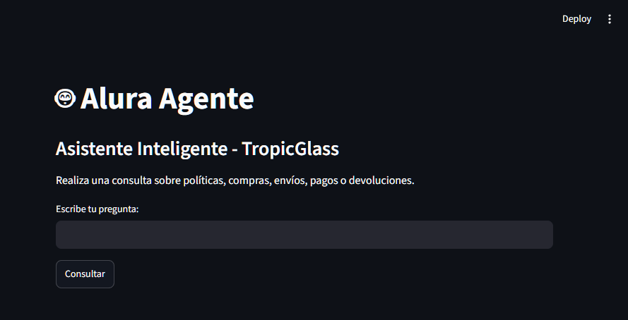
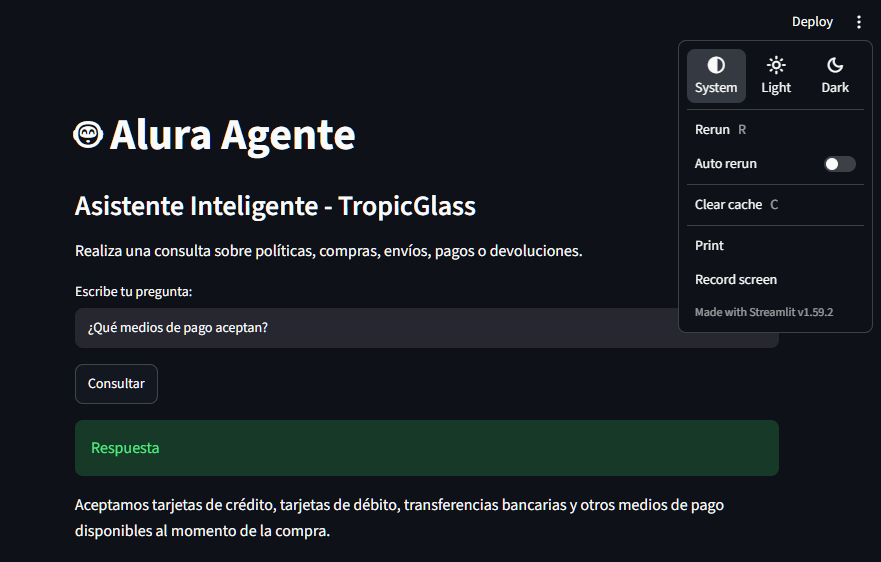
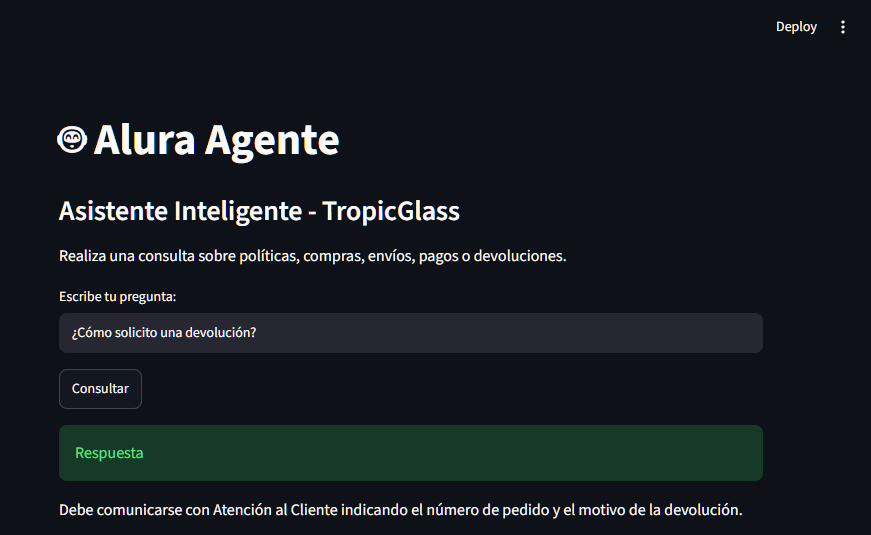
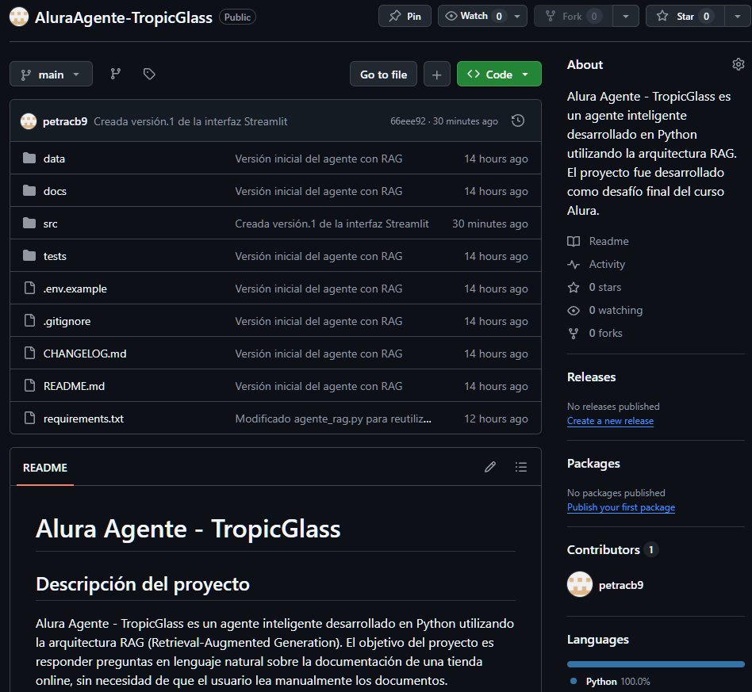
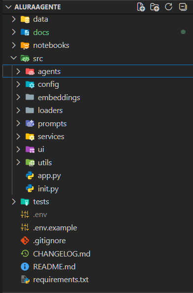
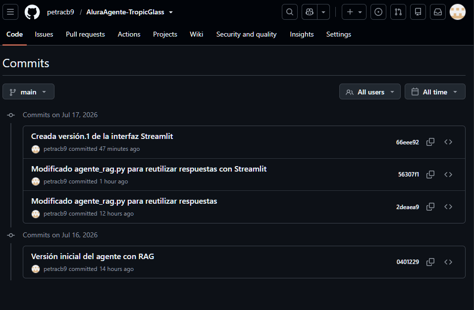
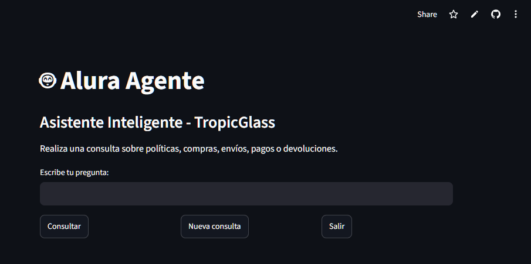
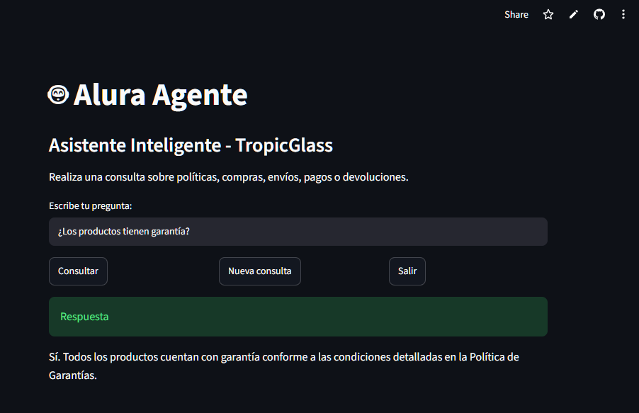
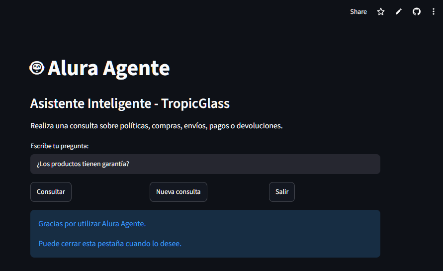

# Alura Agente - TropicGlass

## Descripción del proyecto

Alura Agente - TropicGlass es un agente inteligente desarrollado en Python utilizando la arquitectura RAG (Retrieval-Augmented Generation). El objetivo del proyecto es responder preguntas en lenguaje natural sobre la documentación de una tienda online, sin necesidad de que el usuario lea manualmente los documentos.

El agente procesa un documento PDF, genera un índice vectorial con FAISS y utiliza un modelo de lenguaje para responder preguntas basándose únicamente en la información contenida en dicho documento.

Este proyecto fue desarrollado como desafío final del curso **Alura Agente**.

---

# Objetivos

- Automatizar la consulta de documentos empresariales.
- Implementar un sistema RAG utilizando LangChain.
- Procesar documentos PDF.
- Responder preguntas utilizando únicamente la información disponible en el documento.
- Desplegar el proyecto en la nube.

---

# Arquitectura de la solución

```
Usuario
    │
    ▼
Pregunta
    │
    ▼
Agente RAG
    │
    ▼
Retriever (FAISS)
    │
    ▼
Fragmentos relevantes del PDF
    │
    ▼
Prompt
    │
    ▼
Modelo LLM (Gemma / Gemini)
    │
    ▼
Respuesta
```

---

# Tecnologías utilizadas

- Python 3.12
- LangChain
- FAISS
- Google AI Studio
- Gemma 4
- ReportLab
- PyPDF
- VS Code
- Git
- GitHub

---

# Estructura del proyecto

```
AluraAgente/

│
├── data/
│   ├── faiss_index/
│   └── pdf/
│
├── docs/
│
├── notebooks/
│
├── src/
│   ├── agents/
│   ├── config/
│   ├── embeddings/
│   ├── loaders/
│   ├── prompts/
│   ├── services/
│   ├── utils/
│   └── app.py
│
├── tests/
│
├── .env.example
├── .gitignore
├── CHANGELOG.md
├── README.md
└── requirements.txt
```

---

# Instalación

## 1. Clonar el repositorio

```bash
git clone URL_DEL_REPOSITORIO
```

## 2. Entrar al proyecto

```bash
cd AluraAgente
```

## 3. Crear entorno virtual

```bash
python -m venv .venv
```

## 4. Activar el entorno

Windows

```bash
source .venv/Scripts/activate
```

Linux / macOS

```bash
source .venv/bin/activate
```

## 5. Instalar dependencias

```bash
pip install -r requirements.txt
```

## 6. Configurar la API

Crear un archivo `.env`

```
GOOGLE_API_KEY=TU_API_KEY
```

---

# Ejecución

```bash
python src/app.py
```

---

# Documentación utilizada

El agente responde utilizando el documento:

```
data/pdf/TropicGlass_Manual_Cliente.pdf
```

El documento incluye:

- Política de Privacidad
- Política de Reembolsos y Devoluciones
- Preguntas Frecuentes
- Guía de Envíos y Entregas
- Términos y Condiciones
- Medios de Pago
- Garantías
- Contacto y Atención

---

# Ejemplos de preguntas

- ¿Qué medios de pago aceptan?
- ¿Cómo solicito una devolución?
- ¿Cuánto demora un envío?
- ¿Qué garantía tienen los productos?
- ¿Cómo protegen mis datos personales?

---

# Ejemplo de respuesta

Pregunta

```
¿Qué medios de pago aceptan?
```

Respuesta

```
Aceptamos tarjetas de crédito, tarjetas de débito,
transferencias bancarias y otros medios de pago
disponibles al momento de la compra.
```

---

# Características principales

- Procesamiento automático de documentos PDF.
- División inteligente del contenido.
- Búsqueda semántica mediante FAISS.
- Recuperación de contexto relevante.
- Respuestas generadas por un modelo LLM.
- Arquitectura modular y reutilizable.

---

## Evidencias

### Interfaz



### Consulta de medios de pago



### Consulta de devolución



### Repositorio



### Estructura del proyecto



### Historial de commits



### APP



### Consulta desplegada



### Salida desplegada



---

# Posibles mejoras

- Interfaz web con Streamlit.
- Soporte para múltiples documentos.
- Historial de conversaciones.
- Carga dinámica de nuevos documentos.
- Memoria conversacional.
- Despliegue en la nube.

---

# Autor

Proyecto desarrollado como desafío final del curso **Alura Agente**.
